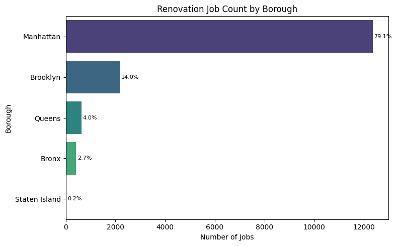
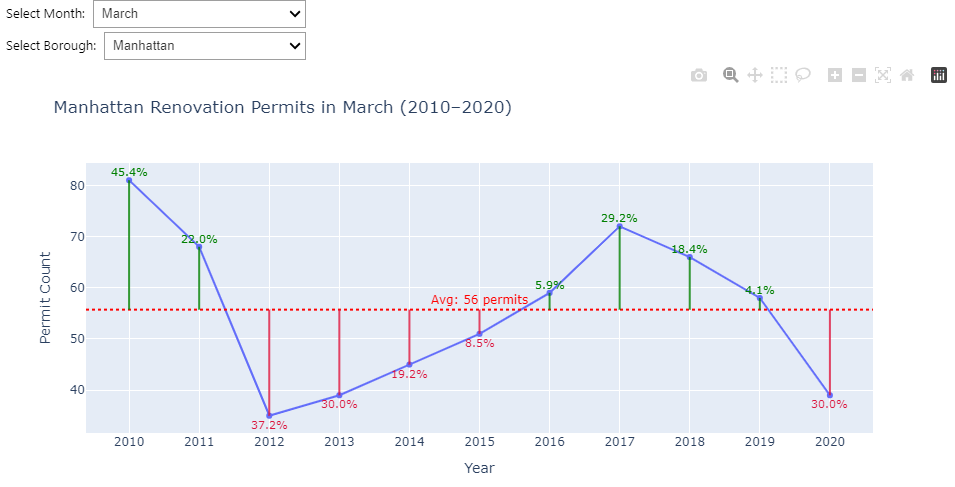
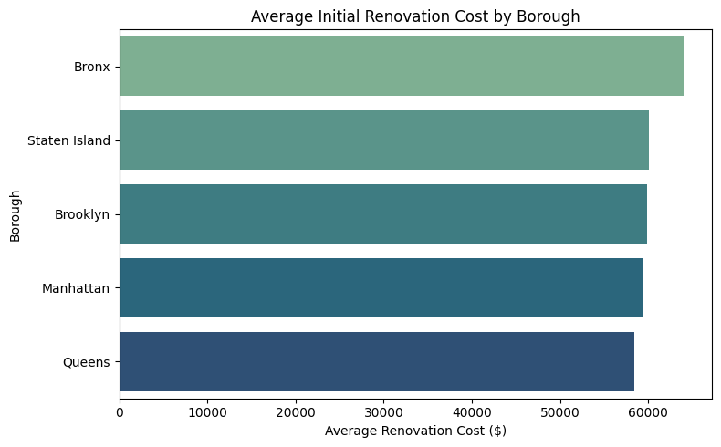
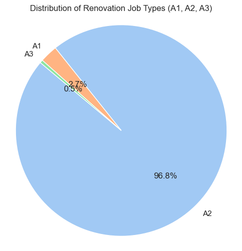
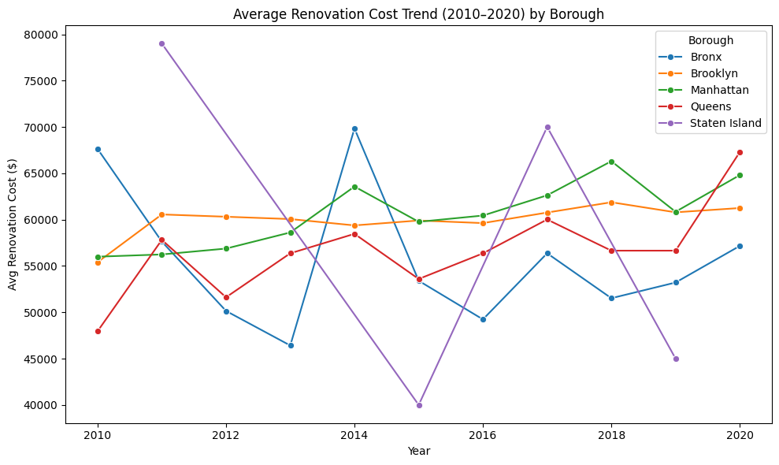
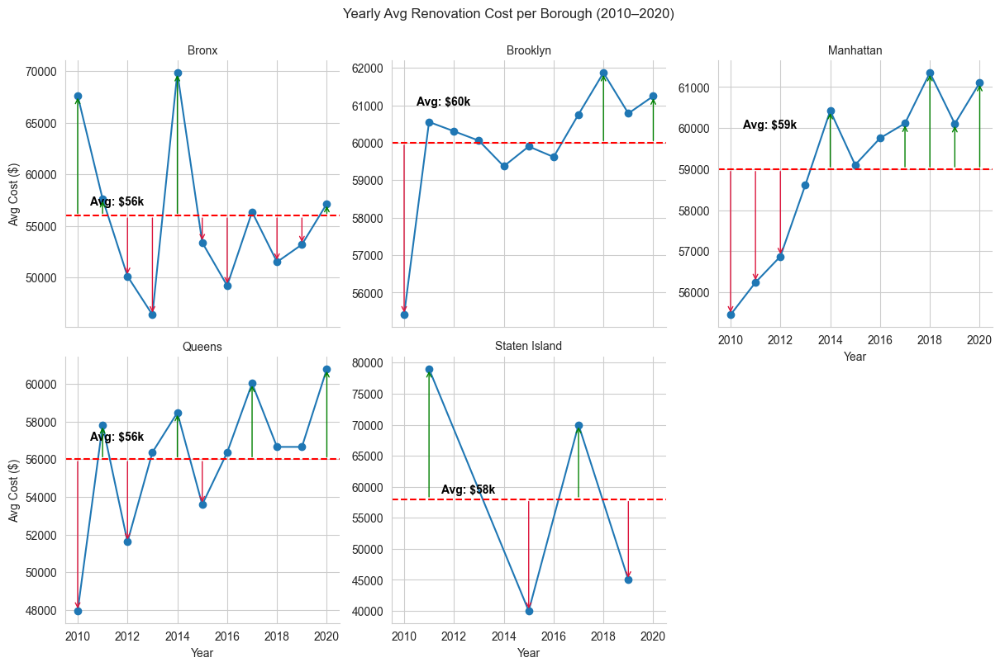
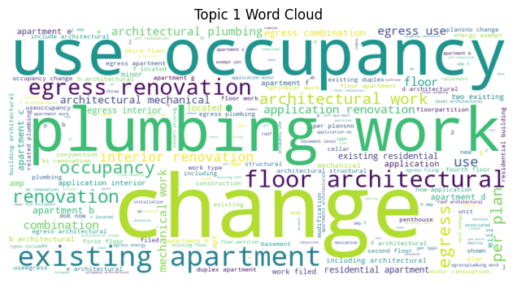
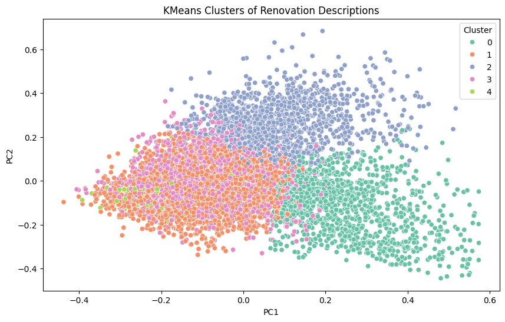
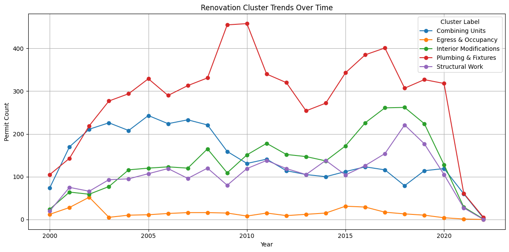
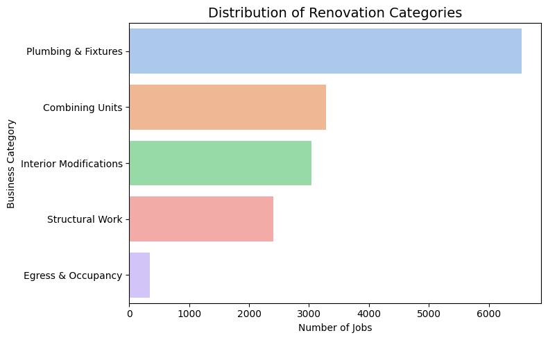

# 🏗️ NYC Renovation Trend Analysis – Streamlit Dashboard

[](https://nyc9construction9rennovation9trend9analysis.streamlit.app/)

> Interactive Streamlit app to analyze NYC renovation permits using NLP, ML, and visual analytics.

---

## 🚀 Live App

🔗 [Click to Launch Dashboard](https://nyc9construction9rennovation9trend9analysis.streamlit.app/)

---

## 📊 Project Overview

This dashboard provides real-time insights into NYC renovation trends using:

- 📈 **Cost analytics by borough**
- 🧾 **NLP on job descriptions**
- 🔍 **Clustering of jobs**
- 🤖 **Cost & category prediction models**

---

## 📂 Dataset Source

Data is sourced from:
👉 [NYC DOB Permit Issuance Dataset](https://data.cityofnewyork.us/Housing-Development/DOB-Permit-Issuance/ipu4-2q9a)

---

## 🧠 Key Features

- Interactive borough filters, trend charts, boxplots
- TF-IDF & NMF Topic Modeling
- KMeans clustering with PCA projection
- Word clouds, category labeling, seasonality analysis
- Exportable charts and data downloads

---

## 📸 Screenshots

### 📍 Renovation Jobs by Borough


### 📅 Time Trends – Monthly Permit Analysis


### 💰 Avg Initial Renovation Cost by Borough


### 🧱 Distribution of Job Types (A1/A2/A3)


### 📈 Cost Trends (2010–2020) by Borough


### 📊 Faceted Cost Trend View (w/ Avg)


### 🌐 Topic 1 Word Cloud from Job Descriptions


### 🔍 PCA Cluster Plot of Job Descriptions


### 📈 Cluster Trends Over Time


### 🧩 Renovation Categories (Derived from Clustering)


---

## 🛠️ How to Run Locally

### ✅ Clone Repository

```bash
git clone https://github.com/Harish-34/renovation-trend-analysis.git
cd renovation-trend-analysis
```

### ✅ Create Virtual Environment

```bash
python -m venv venv
source venv/bin/activate  # For Windows: venv\Scripts\activate
```

### ✅ Install Requirements

```bash
pip install -r requirements.txt
```

### ✅ Launch Streamlit App

```bash
streamlit run src/streamlit_app.py
```

---

## 📁 Project Structure

```bash
renovation-trend-analysis/
├── data/
│   ├── raw_data/
│   └── processed_data/
├── models/
│   └── *.pkl
├── reports/
│   ├── images/
│   │   ├── image1.png ... image10.png
├── src/
│   └── streamlit_app.py
├── requirements.txt
└── README.md
```

---

## 🔧 Tech Stack

- **Frontend:** Streamlit
- **Backend/Data:** Python, Pandas, NumPy
- **Visualization:** Seaborn, Plotly, Matplotlib
- **ML & NLP:** Scikit-learn, TF-IDF, NMF, KMeans
- **Time Series:** statsmodels
- **Word Cloud:** wordcloud

---

## 📤 Outputs

- 📥 Downloadable Cleaned Dataset
- 📊 Exportable PNG Visuals
- 🔍 Live Prediction for Job Category & Estimated Cost

---

## 🙋‍♀️ Author

**Harish Chowdary**  
💼 [LinkedIn](https://www.linkedin.com/in/harish-chowdary)  
🌐 [Live App](https://nyc9construction9rennovation9trend9analysis.streamlit.app/)

